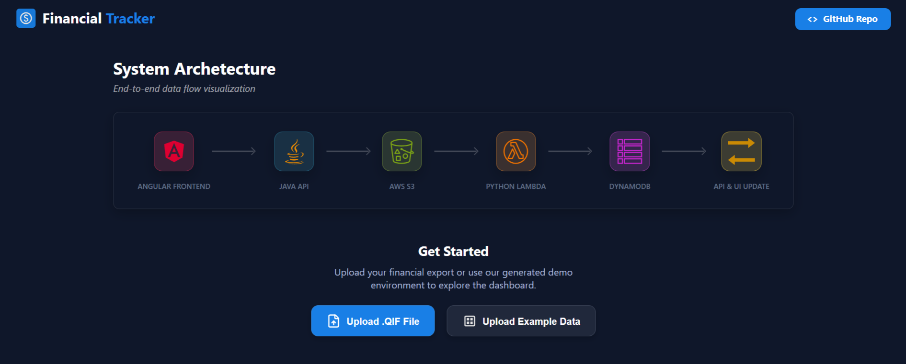
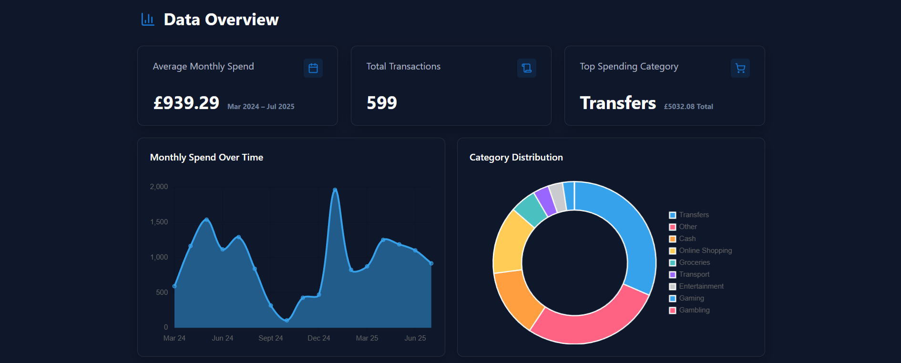

# Financial Tracker

Live App: https://philtbatt.github.io/financial-tracker-app

This is the frontend for my **Financial Tracker** application.  
The fullstack application allows users to upload transaction files, which are sent to a Java Spring Boot API and processed by a Python AWS Lambda function. The processed data is stored in DynamoDB and then retrieved via the API to display on the Angular frontend.

This frontend is part of a full-stack application, alongside:
- a [Java Spring Boot API](https://github.com/PhilTBatt/financial-tracker-api)
- a [Python AWS Lambda function](https://github.com/PhilTBatt/financial-tracker-api-lambda-layer)

---

| Home Section | Data Section |
|---|---|
|  |  |

## Tech Stack

- Angular
- TypeScript
- HTML / CSS
- GitHub Pages

---

## Development Setup

### Prerequisites
- Node.js
- Angular CLI

### Install dependencies
```bash
npm install
```

### Run locally
```bash
ng serve
```

### Then open
```bash
http://localhost:4200
```

## Build
To build the project for production:
```bash
ng build
```
Build output will be generated in the dist/ directory.
